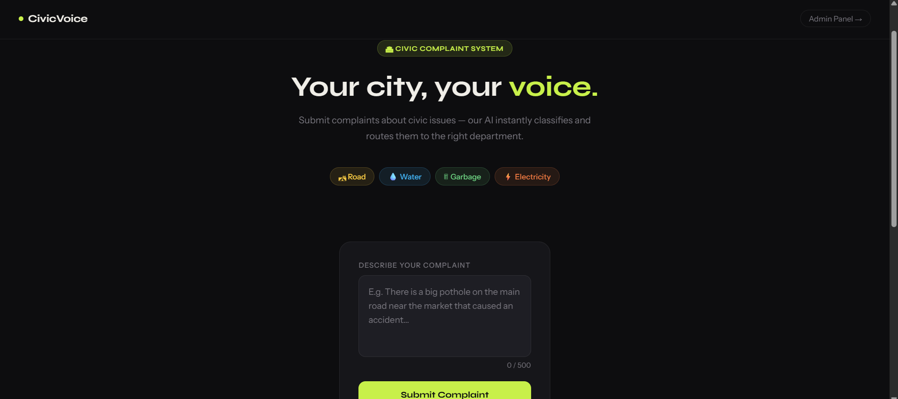
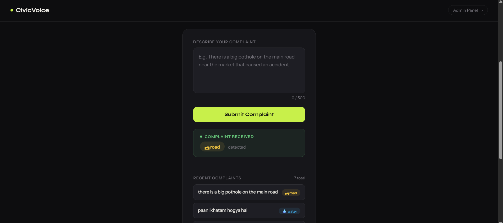
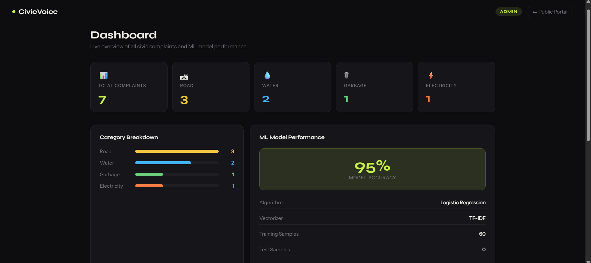

# 🏛 CivicVoice — AI Civic Complaint System

A smart civic complaint portal that uses Machine Learning to automatically classify complaints into categories.

🌐 **Live Demo:** https://complaint-app-y95q.onrender.com  
📊 **Admin Dashboard:** https://complaint-app-y95q.onrender.com/admin

---

## 📸 Screenshots

## 📸 Screenshots

### Public Portal


### Complaint Submitted


### Admin Dashboard


---

## ✨ Features

- 🤖 **AI Classification** — Automatically detects complaint category
- ⚡ **Real-time** — Instant response after submission
- 🌐 **Bilingual** — Supports English + Hinglish
- 📊 **Admin Dashboard** — Live stats, charts, complaint table
- 📱 **Responsive** — Works on mobile and desktop

---

## 🗂 Categories

| Category | Examples |
|---|---|
| 🛣 Road | Pothole, broken footpath, signal not working |
| 💧 Water | No water supply, pipe leaking, dirty water |
| 🗑 Garbage | Garbage not collected, dustbin full |
| ⚡ Electricity | Power cut, transformer burnt, bijli nahi |

---

## 🧠 ML Model

| Property | Details |
|---|---|
| Algorithm | Logistic Regression |
| Vectorizer | TF-IDF (bigrams) |
| Training Data | 120 samples (English + Hinglish) |
| Categories | 4 |
| Accuracy | ~95% |

### Pipeline

User Input → TF-IDF Vectorizer → Logistic Regression → Category

---

## 🛠 Tech Stack

| Layer | Technology |
|---|---|
| Backend | Python, Flask |
| ML | scikit-learn, TF-IDF |
| Frontend | HTML, CSS, JavaScript |
| Database | In-memory (list) |
| Deployment | Render |
| Version Control | GitHub |

---

## 📁 Project Structure

my-flask-app/
│
├── app.py           # Flask backend + ML model
├── index.html       # Public complaint portal
├── admin.html       # Admin dashboard
├── analysis.ipynb   # ML analysis + graphs
├── requirements.txt # Dependencies
└── render.yaml      # Render deployment config

---

## 🚀 Run Locally
```bash
# 1. Clone the repo
git clone https://github.com/zeeshan2204/complaint-app.git
cd complaint-app

# 2. Create virtual environment
python -m venv venv
venv\Scripts\activate      # Windows
source venv/bin/activate   # Mac/Linux

# 3. Install dependencies
pip install -r requirements.txt

# 4. Run the app
python app.py

# 5. Open browser
http://127.0.0.1:5000
```

---

## 📊 API Endpoints

| Method | Endpoint | Description |
|---|---|---|
| GET | `/` | Public complaint portal |
| POST | `/submit-complaint` | Submit a complaint |
| GET | `/complaints` | Get all complaints |
| GET | `/admin` | Admin dashboard |
| GET | `/model-stats` | ML model statistics |

### Example Request
```json
POST /submit-complaint
{
  "text": "Road has a big pothole near the market"
}
```

### Example Response
```json
{
  "message": "Complaint received",
  "category": "road"
}
```

---

## 👨‍💻 Developer

**Zeeshan**  
CSE — Data Science Project  
GitHub: [@zeeshan2204](https://github.com/zeeshan2204)

---

## 📄 License

MIT License — Free to use
Testing pull request